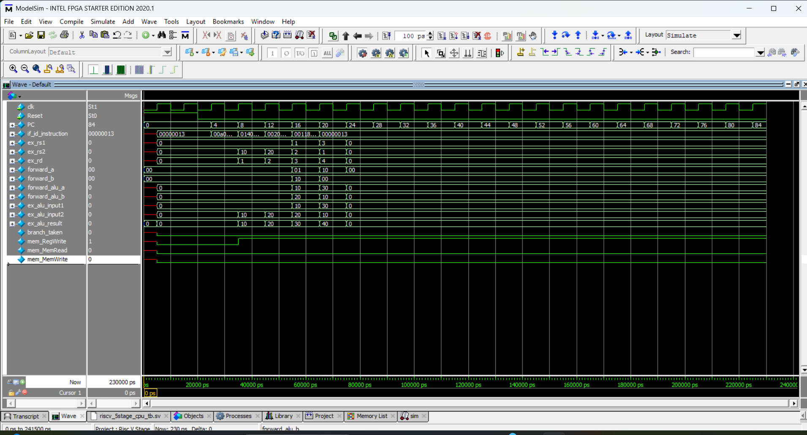
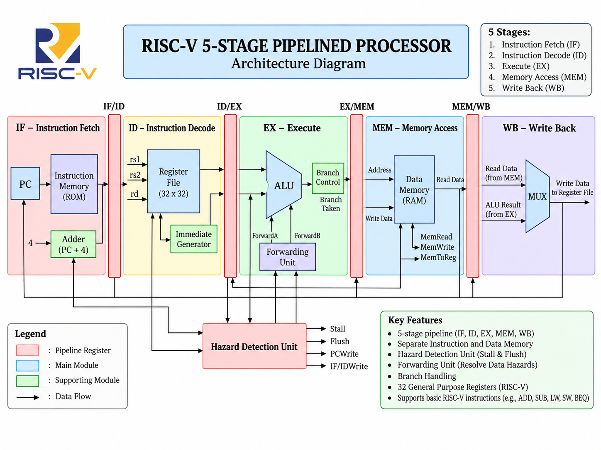
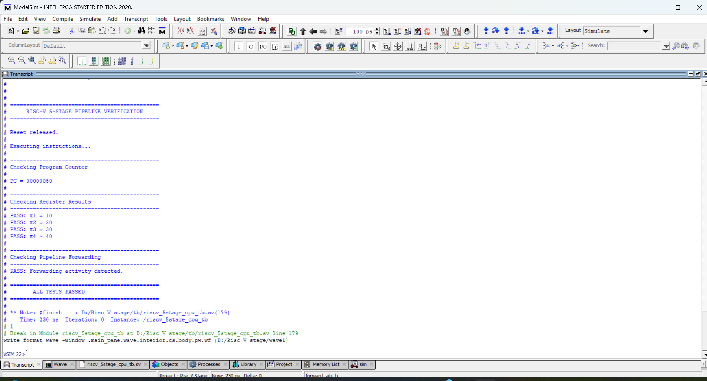

# Risc-V-5-Stage-Pipelined-Processor
Design and verification of a RISC-V 5-stage pipelined processor using Verilog/System Verilog and ModelSim
# RISC-V 5-Stage Pipelined Processor

A RISC-V 5-stage pipelined processor designed and verified using
Verilog/SystemVerilog and ModelSim.

## Pipeline Architecture

The processor follows five pipeline stages:

IF → ID → EX → MEM → WB

### Main Components

- Program Counter
- Instruction Memory
- Register File
- Control Unit
- Immediate Generator
- ALU
- Data Memory
- Pipeline Registers
- Hazard Detection Unit
- Forwarding Unit

## Hazard Handling

The processor implements pipeline forwarding and hazard detection
to handle data dependencies between instructions.

## Verification

The design was simulated using ModelSim Intel FPGA Starter Edition.

### Results

- x1 = 10 ✓
- x2 = 20 ✓
- x3 = 30 ✓
- x4 = 40 ✓
- Forwarding activity detected ✓
- All tests passed ✓

## Waveform



## Architecture



## Verification



## Tools Used

- Verilog/SystemVerilog
- ModelSim
- RISC-V ISA
- VS Code

## Project Structure

```text
rtl/    - Processor RTL modules
tb/     - Testbench
docs/   - Architecture and simulation results
